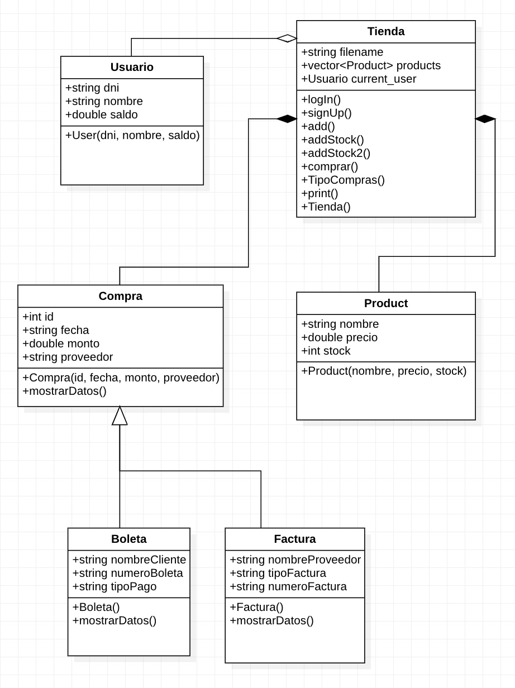

# Ingeniería de Software

# **Integrantes**:

  * ## Enzo Camizan Vidal - 202110047
  * ## Paolo Vásquez - 202110379
  * ## Valeria Espinoza -  202110109
  * ## Valentín Quezada  - 202120750
  * ## Sofía García  - 202110567

# **Testing**:

* ## Pruebas unitarias: testing.cpp --> Ejecutar en main.cpp
* ## Casos de prueba manual: https://docs.google.com/spreadsheets/d/1UsQCinxbMW8iuZLum0PsGHt5ktPJP5rXj9ZrMXUrOpE/edit?usp=sharing
